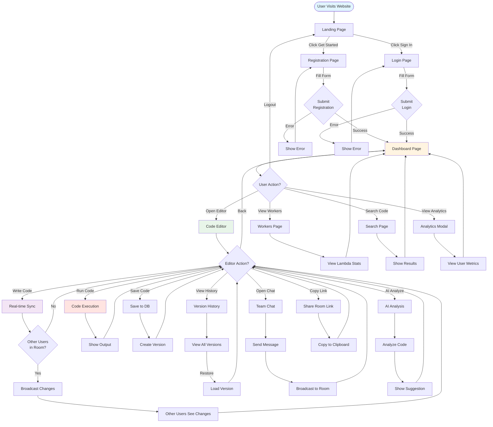
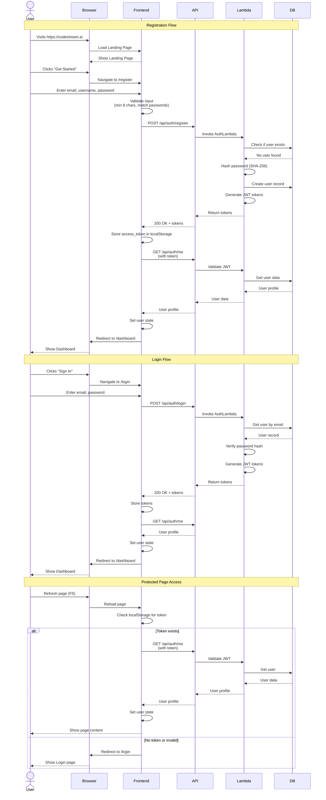
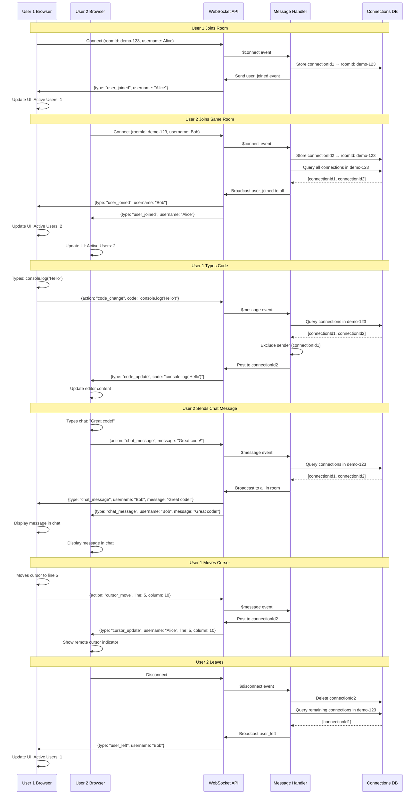
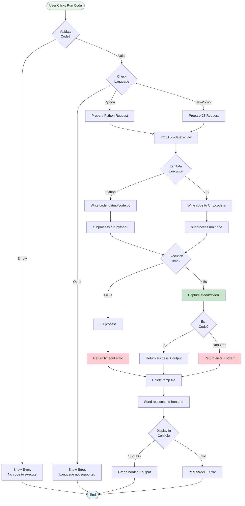
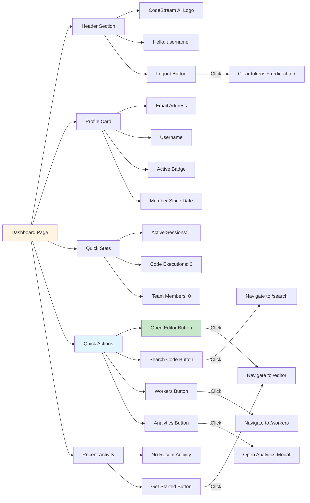

# 👥 **CodeStream AI - User Flow Diagrams**

## **1. Complete User Journey**



---

## **2. Authentication Flow (Detailed)**



---

## **3. Code Editor Flow**

```mermaid
graph TB
    Start([User Opens Editor]) --> Load[Load Editor Page]
    
    Load --> CheckRoom{Room ID<br/>in URL?}
    CheckRoom -->|Yes| UseRoom[Use Existing Room]
    CheckRoom -->|No| GenRoom[Generate Random Room ID]
    
    UseRoom --> FetchCode[Fetch Code from DB]
    GenRoom --> DefaultCode[Load Default Code]
    
    FetchCode --> InitEditor[Initialize Monaco Editor]
    DefaultCode --> InitEditor
    
    InitEditor --> ConnectWS[Connect WebSocket]
    ConnectWS --> WSSuccess{Connection<br/>Success?}
    
    WSSuccess -->|Yes| ShowConnected[Show Green Badge]
    WSSuccess -->|No| ShowDisconnected[Show Red Badge]
    
    ShowConnected --> Ready[Editor Ready]
    ShowDisconnected --> Ready
    
    Ready --> UserAction{User Action}
    
    UserAction -->|Types Code| TypeCode[Code Change Event]
    TypeCode --> BroadcastCode[Broadcast via WebSocket]
    BroadcastCode --> UpdateRemote[Update Other Users]
    UpdateRemote --> UserAction
    
    UserAction -->|Moves Cursor| CursorMove[Cursor Position Event]
    CursorMove --> BroadcastCursor[Send Cursor Data]
    BroadcastCursor --> ShowCursor[Show Remote Cursors]
    ShowCursor --> UserAction
    
    UserAction -->|Clicks Run| RunCode[Execute Code]
    RunCode --> DetectLang{Language?}
    DetectLang -->|Python| ExecPython[Python Lambda]
    DetectLang -->|JavaScript| ExecJS[JS Lambda]
    ExecPython --> ShowOutput[Display Output Console]
    ExecJS --> ShowOutput
    ShowOutput --> UserAction
    
    UserAction -->|Clicks Save| SaveCode[Save to DynamoDB]
    SaveCode --> IncVersion[Increment Version]
    IncVersion --> ShowSaved[Show "Saved!" Message]
    ShowSaved --> UserAction
    
    UserAction -->|Clicks History| OpenHistory[Open Version Modal]
    OpenHistory --> FetchVersions[Get All Versions]
    FetchVersions --> DisplayVersions[Display Version List]
    DisplayVersions --> SelectVersion{User Selects<br/>Version?}
    SelectVersion -->|Yes| RestoreVersion[Load Selected Version]
    SelectVersion -->|No| CloseModal[Close Modal]
    RestoreVersion --> UpdateEditor[Update Editor Content]
    UpdateEditor --> UserAction
    CloseModal --> UserAction
    
    UserAction -->|Clicks Chat| OpenChat[Open Chat Sidebar]
    OpenChat --> TypeMsg[User Types Message]
    TypeMsg --> SendMsg[Send via WebSocket]
    SendMsg --> BroadcastMsg[Broadcast to Room]
    BroadcastMsg --> ShowMsg[Display in All Chats]
    ShowMsg --> UserAction
    
    UserAction -->|Clicks AI Analyze| StartAI[Start AI Analysis]
    StartAI --> AnalyzeCode[Analyze Code Syntax]
    AnalyzeCode --> ShowSuggestion[Show AI Suggestion]
    ShowSuggestion --> UserAction
    
    UserAction -->|Clicks Copy Link| CopyLink[Copy Room URL]
    CopyLink --> Clipboard[Write to Clipboard]
    Clipboard --> ShowCopied[Show "Copied!" Message]
    ShowCopied --> UserAction
    
    UserAction -->|Clicks Dashboard| GoBack[Navigate to Dashboard]
    GoBack --> End([Exit Editor])
    
    style Start fill:#e8f5e9
    style Ready fill:#fff4e1
    style UserAction fill:#e1f5ff
    style End fill:#ffebee
```

---

## **4. Multi-User Real-Time Collaboration**



---

## **5. Code Execution Flow**



---

## **6. Version Control Flow**

```mermaid
graph TB
    Start([User Edits Code]) --> AutoSave{Auto-save<br/>Timer?}
    
    AutoSave -->|30 seconds elapsed| SaveAuto[Auto-save triggered]
    AutoSave -->|User clicks Save| SaveManual[Manual save]
    
    SaveAuto --> CheckChanges{Code<br/>Changed?}
    SaveManual --> CheckChanges
    
    CheckChanges -->|No| Skip[Skip save]
    CheckChanges -->|Yes| PrepSave[Prepare save request]
    
    Skip --> Start
    
    PrepSave --> QueryVersion[Query current version]
    QueryVersion --> GetLatest[Get latest version number]
    GetLatest --> Increment[Increment version]
    
    Increment --> SaveDB[Save to DynamoDB]
    SaveDB --> Record{Record<br/>Structure}
    
    Record --> Fields["{<br/>roomId: 'xyz',<br/>version: 3,<br/>code: '...',<br/>language: 'python',<br/>userId: 'alice',<br/>timestamp: 1789355521<br/>}"]
    
    Fields --> Stored[Stored in CodeRoomsTable]
    Stored --> ShowFeedback[Show "Saved!" message]
    ShowFeedback --> ResetTimer[Reset auto-save timer]
    ResetTimer --> Start
    
    Start -->|User clicks History| OpenHistory[Open Version History Modal]
    OpenHistory --> QueryAll[Query all versions for room]
    QueryAll --> SortDesc[Sort by version DESC]
    SortDesc --> DisplayList[Display version list]
    
    DisplayList --> UserSelect{User<br/>Selects?}
    
    UserSelect -->|Click version| LoadVersion[Load selected version]
    UserSelect -->|Close modal| CloseModal[Close modal]
    
    LoadVersion --> ReplaceCode[Replace editor content]
    ReplaceCode --> ShowRestored[Show "Version restored" message]
    ShowRestored --> CloseModal
    
    CloseModal --> Start
    
    style Start fill:#e1f5ff
    style SaveDB fill:#c8e6c9
    style LoadVersion fill:#fff4e1
```

---

## **7. Dashboard Navigation**



---

## **8. Error Handling Flow**

```mermaid
graph TB
    Action([User Action]) --> Request[Make API Request]
    Request --> Response{Response<br/>Status?}
    
    Response -->|200 OK| Success[Process Success]
    Response -->|400 Bad Request| ClientError[Show Validation Error]
    Response -->|401 Unauthorized| AuthError[Token Invalid/Expired]
    Response -->|403 Forbidden| PermError[Show Permission Error]
    Response -->|404 Not Found| NotFound[Show Resource Not Found]
    Response -->|500 Server Error| ServerError[Show Server Error]
    Response -->|Network Error| NetworkError[Show Connection Error]
    
    Success --> UpdateUI[Update UI]
    UpdateUI --> End([End])
    
    ClientError --> ShowMsg1[Display error message]
    ShowMsg1 --> End
    
    AuthError --> ClearTokens[Clear localStorage tokens]
    ClearTokens --> RedirectLogin[Redirect to /login]
    RedirectLogin --> End
    
    PermError --> ShowMsg2[Display permission error]
    ShowMsg2 --> End
    
    NotFound --> ShowMsg3[Display 404 error]
    ShowMsg3 --> End
    
    ServerError --> ShowMsg4[Display server error]
    ShowMsg4 --> RetryOption{Retry<br/>Option?}
    RetryOption -->|Yes| Request
    RetryOption -->|No| End
    
    NetworkError --> ShowMsg5[Display connection error]
    ShowMsg5 --> CheckInternet{Check<br/>Internet?}
    CheckInternet -->|Retry| Request
    CheckInternet -->|Cancel| End
    
    style Success fill:#c8e6c9
    style AuthError fill:#ffcdd2
    style ServerError fill:#ffcdd2
    style NetworkError fill:#fff3e0
```



---

## **Key User Flows Summary**

### **1. New User Flow**
1. Visit landing page
2. Click "Get Started"
3. Register with email/username/password
4. Automatically logged in
5. Redirected to dashboard
6. Click "Open Editor"
7. Start coding immediately

### **2. Returning User Flow**
1. Visit landing page
2. Click "Sign In"
3. Login with credentials
4. Redirected to dashboard
5. Resume work

### **3. Code Collaboration Flow**
1. User A creates room
2. User A copies room link
3. User A shares link with User B
4. User B opens link
5. User B logs in (if needed)
6. User B joins same room
7. Both users see each other's changes in real-time

### **4. Code Execution Flow**
1. Write code in editor
2. Click "Run Code"
3. Code sent to Lambda
4. Lambda executes in sandbox
5. Output returned to frontend
6. Display in console below editor

### **5. Version Control Flow**
1. Write code
2. Click "Save" or wait 30s (auto-save)
3. Version stored in DynamoDB
4. Click "History" to view versions
5. Select version to restore
6. Code loaded into editor

---

**User Experience Principles:**
- ✅ Minimal clicks to start coding (3 clicks from landing to editor)
- ✅ Real-time feedback (WebSocket updates)
- ✅ Auto-save (no lost work)
- ✅ Clear error messages
- ✅ Loading states for all actions
- ✅ Keyboard shortcuts (Ctrl+S to save)
- ✅ Responsive UI (works on all screen sizes)

**Designed for:** Collaborative coding, code sharing, real-time pair programming
